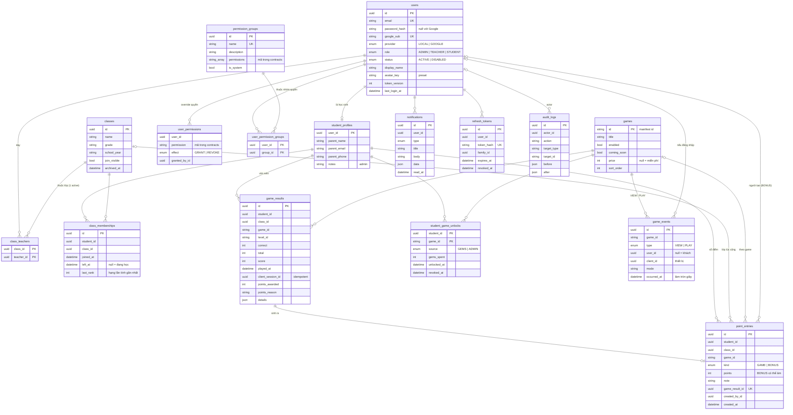

# ERD

Nguồn sự thật: [`apps/api/prisma/schema.prisma`](../../apps/api/prisma/schema.prisma) (tên bảng / cột snake_case).

## Quyết định dữ liệu

- **Một bảng `users`** cho cả 3 role; `student_profiles` chỉ thêm thông tin phụ huynh. Giáo viên / admin không
  có profile.
- **Membership có lịch sử**: đổi lớp = đóng dòng cũ (`left_at`) + tạo dòng mới. Partial unique index
  `class_memberships_active_student (student_id) WHERE left_at IS NULL` (thêm tay trong migration) bảo đảm
  mỗi học sinh một lớp tại một thời điểm.
- **Sổ điểm (`point_entries`) là ledger**: không có cột "tổng điểm"; tổng = `SUM(points)`. Xếp hạng lớp = tổng
  điểm (mọi lớp, mọi game) của các thành viên đang hoạt động → **điểm đi theo học sinh** ([ADR 0006](../adr/0006-points-follow-student.md)).
  `class_id` trên bút toán chỉ để báo cáo "điểm phát sinh khi ở lớp nào". Lọc theo `game_id` cho xếp hạng
  theo game.
- **`last_rank`** nằm trên membership (hạng là khái niệm theo lớp); tính lại sau mỗi bút toán để phát hiện đổi hạng.
- **Quyền**: catalog chức năng trong code; admin tạo **nhóm quyền** (`permission_groups`) từ catalog và gán cho
  user; override GRANT / REVOKE theo user vẫn có. Hiệu lực = mặc định role ∪ nhóm ∪ GRANT − REVOKE
  ([ADR 0007](../adr/0007-permissions-catalog-in-code.md), [ADR 0013](../adr/0013-permission-groups.md)).
- **Game catalog** trên server (`games`) để admin bật / tắt / đặt giá; client vẫn giữ manifest để tải code.
  Mở khoá theo học sinh ở `student_game_unlocks` (`revoked_at` = admin thu hồi).
- **Sự kiện** ẩn danh theo `client_id`; unique `(client_id, game_id, type, occurred_at)` để gửi lại không trùng.
- **Refresh token**: chỉ lưu hash; `family_id` để phát hiện dùng lại ([ADR 0002](../adr/0002-api-separate-origin-jwt-refresh-transport.md)).
- Xoá lớp = `archived_at` (mềm); xoá user là cascade (chỉ admin, hiếm).
